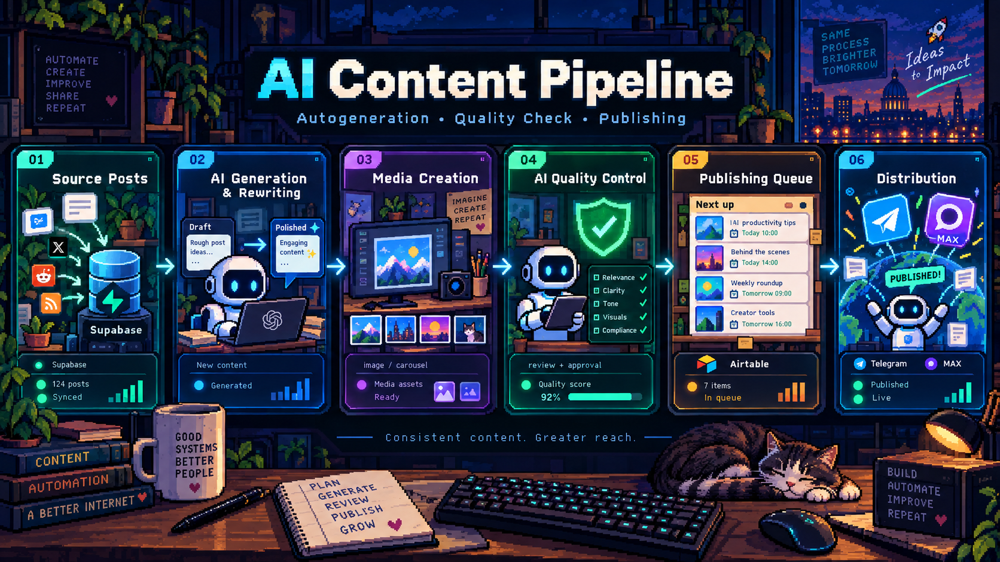

<p align="center">
  
</p>

<div align="center">

# Ivan Borovskikh

### AI Automation Engineer

**LLM Applications · AI Agents · Integrations · Workflow Automation**

`business process → working end-to-end system`

</div>

---

## About

I build applied AI automation systems: agent workflows, LLM-powered processes, API integrations, persistent context and human-in-the-loop scenarios.

My focus is not just generating model responses, but turning a real business process into a reliable system with clear states, deterministic rules, model-driven decisions and end-to-end execution.

## What I build

- **AI agents & LLM workflows** — roles, goals, rules, context, structured output and state routing
- **Workflow automation** — scheduled and event-driven pipelines, retries and error handling
- **Integrations** — REST API, HTTP, JSON, webhooks, Telegram and external services
- **Data & state** — PostgreSQL, Supabase, Airtable, conversation history and document flows
- **Human-in-the-loop systems** — escalation to an administrator when the model does not have enough information
- **AI content systems** — generation, quality control, asset processing and automated publishing

## Featured Project

### [AI Content Pipeline for n8n](https://github.com/ivannyyyy/ai-content-pipeline-n8n)

<p align="center">
  
</p>

An AI-powered content production pipeline split into independent workflows:

```text
Source data
    ↓
AI generation & rewriting
    ↓
Media generation
    ↓
AI quality control
    ↓
Scheduling
    ↓
Telegram / MAX
```

The production version was built for channels with a combined audience of **1M+** and automated the main content-production stages, reducing manual operations by **80–90%**.

## Technologies

| Area | Tools & technologies |
|---|---|
| **AI & LLM** | OpenAI API, Gemini API, AI agents, prompt engineering, structured output, context engineering |
| **Automation** | n8n, workflow orchestration, scheduling, event and error handling |
| **Backend & data** | Python — basic level & scripts, SQL — basic queries, PostgreSQL, Supabase, Airtable |
| **Integrations** | REST API, HTTP, JSON, webhooks, Telegram integrations, Cloudinary, Google Drive |
| **Agent tooling** | MCP tools and integrations |
| **Generative workflows** | AI image & video pipelines |

## How I approach automation

```text
UNDERSTAND → STRUCTURE → AUTOMATE → OBSERVE → IMPROVE
```

I separate deterministic business rules from model decisions, keep state and history explicit, and design automation so that uncertain cases can be handed back to a human instead of being invented by the model.

---

<div align="center">

**Build systems that remove routine work — not human judgment.**

</div>
